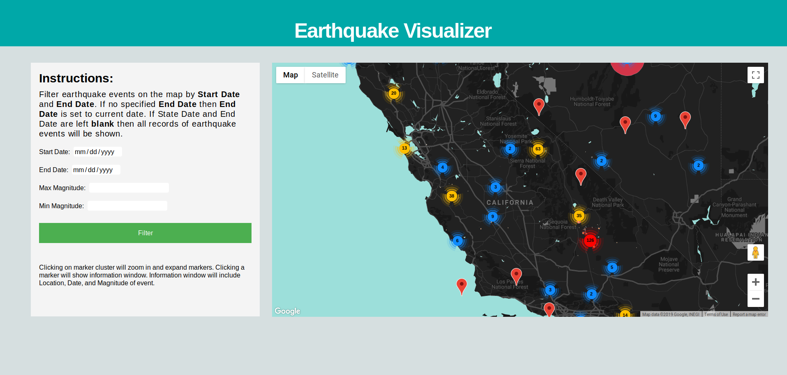

# Earthquake-Visualization

## MVP
- Use Api from USGS to retreive earthquake data and Google maps to display location of earthquakes.
- Use D3.js to create interactive data visualization of events.
- Allow filtering of events by attributes 

## Technologies & APIs
- JavaScript
- USGS API
- Google Maps API
